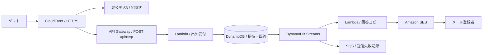

# Wedding Invitation

React / TypeScript / Vite と AWS CDK v2 で構成した結婚式のWeb招待状です。出欠をDynamoDBに保存し、任意のメールアドレスを登録した方にだけSESで回答のコピーを送信します。

## 初期設定・ローカルプレビュー

Node.js 22以上を使用します。初回はサンプルをコピーし、実際の内容を設定してください。すでに `.env.local` がある場合はコピーせず、そのファイルを編集します。

```powershell
npm ci
Copy-Item .env.example .env.local
npm run dev
```

http://localhost:5173 を開きます。停止は `Ctrl + C`。ローカルはプレビューモードで、回答の保存・メール送信・ブラウザへの個人情報保存は行いません。

## 環境変数ファイル

**実際の名前、式場、住所、日時、メールアドレス、SES設定は `.env.local` に記載します。** `.env` と `.env.*` はGit管理対象外です。コミットするのは架空の設定例を記載した `.env.example` のみです。旧 `wedding.config.json` は廃止しました。

読み込みの優先順位は、シェル・CIの環境変数 → `.env.local` → `.env` です。Vite・CDK・招待リンク発行スクリプトが共通のローダーを使用します。必須項目が不足している場合はエラーになります。

| 環境変数 | 用途 |
| --- | --- |
| `WEDDING_GROOM` / `WEDDING_BRIDE` | 英字のお名前 |
| `WEDDING_GROOM_JAPANESE` / `WEDDING_BRIDE_JAPANESE` | 日本語のお名前 |
| `WEDDING_DATE` / `WEDDING_END_DATE` | 挙式開始・披露宴終了日時。未定なら空欄 |
| `WEDDING_DEADLINE` | 出欠回答締切。必須 |
| `WEDDING_RECEPTION_TIME` / `WEDDING_CEREMONY_TIME` / `WEDDING_PARTY_TIME` | 従来の受付時刻（現在の集合案内では未使用）・挙式時刻・披露宴の時間帯。空欄なら「後日ご案内」 |
| `WEDDING_VENUE` / `WEDDING_VENUE_JAPANESE` | 英字・日本語の会場名 |
| `WEDDING_ADDRESS` / `WEDDING_ACCESS` / `WEDDING_MAP_QUERY` | 住所・アクセス案内・地図検索語 |
| `WEDDING_CONTACT_EMAIL` | 招待状とメール本文の問い合わせ先 |
| `SES_SENDER_EMAIL` | 送信元。空欄なら問い合わせ先を使用 |
| `SES_IDENTITY_DOMAIN` / `SES_IDENTITY_ARN` | 認証済みSES ID。ARNを優先 |
| `SES_CONFIGURATION_SET_NAME` | 使用するSES設定セット。不要なら空欄 |
| `RSVP_GROOM_EMAIL` | 新郎への出欠通知先 |
| `RSVP_BRIDE_EMAIL` | 新婦への出欠通知先 |
| `RSVP_HOST_EMAIL` | 追加の通知先（従来設定との互換用）。不要なら空欄 |

日時は `2099-10-22T11:00:00+09:00` のようにタイムゾーン込みで指定してください。値に空白や `#` がある場合はダブルクォートで囲みます。開始・終了日時が設定されるとカレンダーへの追加が表示されます。

設定変更後は開発サーバーを再起動してください。本番への反映には再ビルド・再デプロイが必要です。メール処理にはCDKからLambda環境変数 `WEDDING_CONFIG` として設定を渡します。

Git管理から外しても、**招待状に表示する名前・式場・日時・問い合わせ先は公開サイトの配信ファイルに含まれます**。フロントエンドには明示した公開項目だけを埋め込み、SES設定・主催者の通知先・AWS認証情報は埋め込みません。`.env.local` を `public/` に置かないでください。生成物の `dist/`、`cdk.out/`、`cdk-outputs.json`、テストのスクリーンショットもGit管理対象外です。

## 検証

```powershell
npm run build
npm test
npm run synth -- --quiet
npm run test:e2e
```

ブラウザテストはEdgeを使います。別のブラウザを使う場合は `playwright.config.ts` の `channel` を変更してください。ユニットテストは `.env.example` の架空の値で動作し、実際の個人情報を必要としません。ブラウザテストは起動中アプリと同じ環境設定を参照します。

## AWS構成・デプロイ



AWS CLIの認証とCDKデプロイ権限がある環境で実行します。AWSの利用料金が発生します。

```powershell
$env:AWS_PROFILE = 'your-profile'
$env:AWS_REGION = 'ap-northeast-1'
$env:CDK_DEFAULT_REGION = 'ap-northeast-1'
# CDKの基盤がないアカウント・リージョンで初回のみ実行
npx cdk bootstrap aws://YOUR_ACCOUNT_ID/ap-northeast-1
npm run deploy
```

公開URLはデプロイの `WebsiteUrl` 出力、または管理対象外の `cdk-outputs.json` で確認できます。スタック名は `WeddingInvitation` です。

### APIエンドポイントの自動設定

CDKは作成したCloudFrontのドメインから回答送信URLを生成し、S3の `config.json` に配置します。`public/config.json` はローカル用のデモ設定で、本番デプロイ時には次の形式に自動的に置き換わります。URLの手入力やフロントエンドへのAPI URLの埋め込みは不要です。

```json
{
  "demo": false,
  "rsvpEndpoint": "https://YOUR_DISTRIBUTION.cloudfront.net/api/rsvp"
}
```

画面は起動時に `/config.json` を読み込み、`rsvpEndpoint` へ回答を送信します。CloudFrontの `/api/*` がCDKで作成されたAPI Gatewayに接続されるため、ブラウザからは同一オリジンのAPIとして利用できます。設定ファイルはCloudFrontでもキャッシュを無効にし、ブラウザは `no-store` で取得します。設定を取得・検証できない場合は送信を無効にします。

生成されたURLは `RsvpEndpoint` 出力でも確認できます。`config.json` はブラウザから参照される公開設定なので、認証情報や招待トークンは記載しません。公開サイトへの変更反映には `npm run deploy` を実行してください。

SES IDを指定しなければ送信元のメールアドレスIDを作成するので、届いた確認メールで認証を完了してください。既存のドメイン・IDを使う場合は環境変数に設定します。既存IDに既定の設定セットがある場合は `SES_CONFIGURATION_SET_NAME` も設定してください。CDKは指定されたIDと設定セットに限定して送信を許可します。

ゲストの任意アドレスへ送るには、利用リージョンで[SESの本番アクセス](https://docs.aws.amazon.com/ses/latest/dg/request-production-access.html)が必要です。[SESのID認証](https://docs.aws.amazon.com/ses/latest/dg/verify-addresses-and-domains.html)も確認してください。SESは受信メールボックスを作成しないため、問い合わせ先の受信設定は既存のメールサービス側で行います。

従来のCDKコンテキスト `senderEmail`、`hostEmail`、`sesIdentityDomain`、`sesIdentityArn`、`sesConfigurationSetName` による上書きも可能ですが、実際の値を `cdk.json` に書き込まず、環境変数ファイルで管理してください。

## 招待リンク・回答の管理

```powershell
npm run invite -- "ゲストのお名前" "親族"
npm run invite -- "ゲストのお名前" "友人"
```

区分は必須です。親族は `?group=family`（11:25・4階親族控室）、友人は `?group=friend`（12:00・4階ロビー）の集合案内を表示します。未指定・不明な区分は友人と同じ案内になります。区分はURLのクエリパラメータだけで切り替え、個人や招待レコード・回答データには紐づけません。

表示される専用URLをゲストに個別にお渡しください。コマンドは招待レコードとURLを作成するだけで、招待メールを送信しません。リンク発行時のメールアドレスは不要です。

1リンクにつき1名・1回答です。同じ内容の再送は成功として扱い、別の内容で上書きしません。変更は新郎新婦への連絡を案内します。同じ方への再発行は新しい回答権限を作るため、旧招待レコードの `disabled` を `true` にしてから行ってください。

回答はDynamoDBコンソールで、出力 `TableName` の `pk` が `RSVP#` から始まるレコードを確認します。管理者用の公開Web画面はありません。

- 招待トークンは256ビットで生成し、ハッシュのみを保存します。URLフラグメントを画面読み込み後に除去するため、再読み込みした際は元の招待リンクを開き直してください。
- トランザクションで招待状の有効期限・失効状態を検証します。APIには入力検証・12KBの入力上限・毎秒2件／バースト10件のスロットリングがあります。
- 回答は締切180日後にTTL削除対象となります。実削除には遅延があります。DynamoDBのPITRを有効化し、テーブルとS3はスタック削除後も保持するため、運用終了時に保持・削除を判断してください。

## メールの再試行・疎通確認

`.env.local` の `RSVP_GROOM_EMAIL` と `RSVP_BRIDE_EMAIL` にお二人の通知先を設定してください。実際のアドレスはGit管理対象外のこのファイルだけに記載します。CDKがLambdaの `GROOM_EMAIL` / `BRIDE_EMAIL` に渡し、ブラウザには公開しません。設定後に `npm run deploy` で反映します。空欄の宛先への通知は行いません。

出席・欠席のどちらでも、回答保存後に新郎・新婦へ個別に通知します。回答者のメールが未入力でも主催者には通知します。主催者用の本文には出欠・名前・任意のメール・アレルギー・メッセージ・受付日時を記載します。回答者がメールを入力した場合は、その方にも従来通り回答コピーを送ります。

送信結果は `guestMailSent` / `groomMailSent` / `brideMailSent`（追加通知先は `hostMailSent`）として別々に保存します。ある宛先が失敗しても残りの宛先への送信を試み、再試行時は送信済みの宛先を除外します。過去の回答への一括通知は行いません。

回答保存後、DynamoDB StreamsからSES送信処理を実行します。メール未入力ならゲストへの送信を行いません。障害時は最大10回再試行し、処理できないイベントをSQSに保存します。CloudWatchアラームの通知先アクションは未設定のため、必要に応じてSNS等を接続してください。

SES受理と送信済みフラグの保存は別処理なので、その間の障害ではコピーが重複する可能性があります。SES受理は受信箱への配送保証ではありません。バウンス・苦情はSES側で確認してください。

障害解消後、対象回答と `guestMailSent` を確認し、出力 `MailerFunctionName` のLambdaを以下のテストイベントで再実行できます。

```json
{"Records":[{"eventName":"INSERT","dynamodb":{"Keys":{"pk":{"S":"RSVP#対象回答のハッシュ"}}}}]}
```

`npx tsx scripts/smoke-live.ts` は実AWSに使い捨ての回答を保存し、AWSシミュレーターへのメール送信を検証します。主催者通知が設定された環境では、お二人にもテスト回答の通知が届きます。この実行のテストレコードは終了時に削除します。`npx tsx scripts/check-live-ui.ts` は公開URLの表示を検証します。いずれも `cdk-outputs.json` を参照します。

`public/photo/` に入れた JPG・PNG・WebP・AVIF を、ファイル名順に「ふたりの思い出」のスライドショーで表示します。5秒ごとに自動で切り替わり、前後の移動・一時停止もできます。動きを減らす設定の端末では停止状態で始まります。写真がない場合はこのセクションを表示しません。写真の追加・削除後は開発サーバーの再起動、本番は再ビルド・再デプロイが必要です。写真はGit管理対象外ですが、デプロイ時には公開サイトに同梱されます。

テーブル・会場の写真は `public/` に同梱したイメージ写真で、実際の会場写真ではありません。Google Fontsの表示には外部ネットワーク接続を使います。
